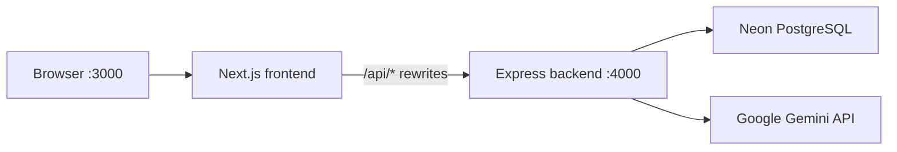

# Harbourside Veterinary Clinic

A full-stack veterinary clinic management system for **Harbourside Veterinary Clinic**. Staff manage pets, appointments, inventory, and billing; pet owners use a self-service portal to view pets, request appointments, and track vaccinations. An AI assistant (**PawBot**) helps both roles with clinic questions using live account data.

All dates and times use **Philippine Time (Asia/Manila)**.

---

## Table of contents

- [Features](#features)
- [Architecture](#architecture)
- [Tech stack](#tech-stack)
- [Prerequisites](#prerequisites)
- [Project structure](#project-structure)
- [Getting started](#getting-started)
- [Environment variables](#environment-variables)
- [Accounts & authentication](#accounts--authentication)
- [API overview](#api-overview)
- [PawBot (AI chatbot)](#pawbot-ai-chatbot)
- [Key workflows](#key-workflows)
- [Scripts reference](#scripts-reference)
- [Deployment notes](#deployment-notes)
- [Troubleshooting](#troubleshooting)

---

## Features

### Admin / staff portal (`/admin`)

| Module | Description |
|--------|-------------|
| **Dashboard** | Overview stats, upcoming appointments, and alerts |
| **Manage Pets** | Register pets, link to owners, track status (available / deceased) |
| **Manage Owners** | Owner profiles, contact info, portal account linking |
| **Schedule** | Book, approve, and manage appointments (scheduled, walk-in, owner requests) |
| **Care History** | Visit records (check-ups, treatments) linked to pets |
| **Deworming** | Deworming schedules and due dates |
| **Inventory** | Stock levels for vaccines, medications, dewormers, and supplies |
| **Lab & Transactions** | Billing records with line items and payment status |
| **Communications** | Simulated SMS/email messages to owners |
| **Reports** | Charts and summaries for clinic operations |
| **PawBot** | AI chat assistant (bottom-right chat bubble) |

### Pet owner portal (`/user`)

| Module | Description |
|--------|-------------|
| **Dashboard** | Summary of pets and upcoming care |
| **My Pets** | View registered pets and details |
| **Appointments** | Request and view appointments |
| **Vaccinations** | Vaccination history and due dates |
| **PawBot** | AI chat assistant for appointments, vaccines, and care tips |

### Cross-cutting

- **Role-based access** — admins and owners see different data; owners are scoped to their own pets and appointments
- **Notifications** — bell icon alerts for due vaccines, upcoming appointments, low inventory (admin), and appointment requests
- **Google sign-in** — pet owners can register/login with a verified Gmail account
- **Profile management** — update name and avatar from the header profile menu
- **Auto care recording** — completing an appointment automatically creates a care record or vaccination entry (see [Key workflows](#key-workflows))
- **Visit types** — appointments support **Check-up**, **Treatment**, and **Vaccine** care types

---

## Architecture

The app is split into a **Next.js frontend** (UI only) and an **Express backend** (API, auth, database). The frontend proxies API calls to the backend via Next.js rewrites — there are no API route handlers inside the Next.js app.



| Layer | Port (dev) | Responsibility |
|-------|------------|----------------|
| Frontend | `3000` | Pages, components, client-side data fetching |
| Backend | `4000` | REST API, JWT cookies, file uploads, AI chat |
| Database | — | [Neon](https://neon.tech) serverless PostgreSQL |

---

## Tech stack

### Frontend (`frontend/`)

- **Next.js 15** (App Router)
- **React 18** + **TypeScript**
- **Tailwind CSS** + **shadcn/ui** (Radix primitives)
- **TanStack Query** for server state
- **Recharts** for reports
- **Lucide** icons

### Backend (`backend/`)

- **Node.js** + **Express 4**
- **TypeScript** (compiled with `tsc`, dev with `tsx watch`)
- **Neon serverless driver** (`@neondatabase/serverless`) for raw SQL
- **Prisma** for schema/client generation
- **jose** for JWT session tokens
- **bcryptjs** for password hashing
- **multer** for image uploads
- **Google Gemini** for PawBot (optional)

### Database

- **PostgreSQL** on Neon
- Schema applied via `backend/db/schema.sql` (`npm run db:push`)
- Prisma models in `backend/prisma/schema.prisma`

---

## Prerequisites

- **Node.js** 20+ (22 recommended)
- **npm** 9+
- A **Neon** PostgreSQL database ([free tier](https://neon.tech) works)
- (Optional) **Google Cloud** project for OAuth and/or Gemini API key

---

## Project structure

```
HARBOURSIDE/
├── package.json              # Root scripts (run both apps)
├── README.md
├── frontend/
│   ├── src/
│   │   ├── app/              # Next.js App Router pages
│   │   ├── components/     # UI components + ChatbotWidget
│   │   ├── hooks/            # useAuth, useNotifications, etc.
│   │   ├── layouts/          # AdminLayout, UserLayout
│   │   ├── lib/              # datetime, notifications, API client
│   │   └── views/            # Page-level view components
│   ├── next.config.ts        # Proxies /api/* → backend
│   └── .env.example
└── backend/
    ├── src/
    │   ├── index.ts          # Express entry point
    │   ├── routes/           # auth, data, chat, upload, appointments
    │   ├── services/         # Business logic (data, auth, chat, google)
    │   ├── middleware/       # requireAuth
    │   └── lib/              # db pool, datetime helpers
    ├── db/schema.sql         # Full PostgreSQL schema + triggers
    ├── prisma/schema.prisma
    ├── scripts/
    │   ├── create-admin.mjs
    │   └── run-schema.mjs
    └── .env.example
```

---

## Getting started

### 1. Clone and install

```powershell
cd C:\HARBOURSIDE
npm install
npm run install:all
```

`install:all` installs dependencies in both `backend/` and `frontend/`.

### 2. Configure environment

Copy the example env files and fill in your values:

```powershell
copy backend\.env.example backend\.env
copy frontend\.env.example frontend\.env
```

See [Environment variables](#environment-variables) for details.

### 3. Set up the database

```powershell
cd backend
npm run db:generate
npm run db:push
cd ..
```

`db:push` runs `backend/db/schema.sql` against your Neon database (creates tables, enums, triggers, and seed data).

### 4. Create the first admin account

Admin accounts **cannot** be created through the public signup page. Use the CLI:

```powershell
npm run create-admin -- admin@clinic.com "Dr. Admin" "your-secure-password"
```

Then sign in at [http://localhost:3000/login](http://localhost:3000/login).

### 5. Start development servers

From the project root:

```powershell
npm run dev
```

This runs both:

- **Backend** → [http://localhost:4000](http://localhost:4000)
- **Frontend** → [http://localhost:3000](http://localhost:3000)

Verify the backend is healthy:

```powershell
curl http://localhost:4000/health
```

---

## Environment variables

### Backend (`backend/.env`)

| Variable | Required | Description |
|----------|----------|-------------|
| `DATABASE_URL` | Yes | Neon PostgreSQL connection string |
| `AUTH_SECRET` | Yes | Long random string for JWT signing (`openssl rand -base64 32`) |
| `PORT` | No | API port (default `4000`) |
| `FRONTEND_URL` | Yes* | Frontend origin for CORS (e.g. `http://localhost:3000`) |
| `GOOGLE_CLIENT_ID` | No | Google OAuth client ID |
| `GOOGLE_CLIENT_SECRET` | No | Google OAuth client secret |
| `GEMINI_API_KEY` | No | Google Gemini API key for PawBot ([AI Studio](https://aistudio.google.com/apikey)) |

\*Defaults to `http://localhost:3000` if omitted.

### Frontend (`frontend/.env`)

| Variable | Required | Description |
|----------|----------|-------------|
| `NEXT_PUBLIC_APP_URL` | Yes | Public app URL (OAuth redirects), e.g. `http://localhost:3000` |
| `BACKEND_URL` | Yes | Backend URL for Next.js rewrites, e.g. `http://localhost:4000` |

> **Note:** The frontend does **not** need `DATABASE_URL`, `AUTH_SECRET`, or `GEMINI_API_KEY`. Keep secrets in `backend/.env` only.

### Google OAuth setup

1. Create a project in [Google Cloud Console](https://console.cloud.google.com/)
2. Enable the Google Identity API
3. Create OAuth 2.0 credentials (Web application)
4. Add authorized redirect URI:

   ```
   {NEXT_PUBLIC_APP_URL}/api/auth/google/callback
   ```

   Example for local dev: `http://localhost:3000/api/auth/google/callback`

5. Set `GOOGLE_CLIENT_ID` and `GOOGLE_CLIENT_SECRET` in `backend/.env`

---

## Accounts & authentication

| Role | How to create | How to sign in |
|------|---------------|----------------|
| **Admin / staff** | `npm run create-admin` only | Email + password |
| **Pet owner** | Public signup at `/signup` | Email + password, or **Continue with Google** |

### Security rules

- Sessions use an HTTP-only cookie (`harbourside_session`) with a 7-day JWT
- Google sign-in requires a **verified `@gmail.com` address** for new pet-owner accounts
- Google sign-in **never** grants admin access automatically
- Passwords must be at least 6 characters
- All `/api/chat` and `/api/data` routes require authentication

### Default routes after login

- Admin → `/admin`
- Owner → `/user`

---

## API overview

The frontend talks to the backend through proxied paths (`/api/*`). Main endpoints:

| Method | Path | Auth | Description |
|--------|------|------|-------------|
| `GET` | `/health` | No | Health check |
| `POST` | `/api/auth/login` | No | Email/password login |
| `POST` | `/api/auth/signup` | No | Owner registration |
| `POST` | `/api/auth/logout` | No | Clear session cookie |
| `GET` | `/api/auth/session` | No | Current session (or null) |
| `GET` | `/api/auth/profile` | Yes | User profile |
| `PATCH` | `/api/auth/profile` | Yes | Update profile |
| `GET` | `/api/auth/google` | No | Start Google OAuth |
| `GET` | `/api/auth/google/callback` | No | OAuth callback |
| `POST` | `/api/data` | Yes | Generic CRUD (`select`, `insert`, `update`) |
| `POST` | `/api/chat` | Yes | PawBot chat messages |
| `POST` | `/api/upload` | Yes | Image upload (returns URL) |
| `GET` | `/api/appointments/availability` | Yes | Slot availability for a date |

### Data API shape

```json
{
  "action": "select",
  "table": "pets",
  "select": "*",
  "filters": [{ "column": "owner_id", "op": "eq", "value": "..." }]
}
```

Table access is authorized per role in `backend/src/services/data.ts`.

---

## PawBot (AI chatbot)

PawBot is available to **signed-in** users on both admin and owner portals (chat bubble, bottom-right).

### How it works

1. User sends a message → `POST /api/chat`
2. Backend loads live context (pets, appointments, vaccinations, inventory alerts)
3. If `GEMINI_API_KEY` is set, tries **Google Gemini** with that context
4. If Gemini is unavailable (no key, quota exceeded, etc.), uses a **local fallback** that answers from real clinic data

### Example questions

- *"What are the clinic hours?"*
- *"When is my next appointment?"*
- *"What vaccines are due?"*
- *"How many pending appointment requests?"* (admin)

### Response modes

| `mode` | Meaning |
|-------|---------|
| `gemini` | Full AI reply from Google Gemini |
| `fallback` | Local assistant (Gemini key present but API failed) |
| `local` | Local assistant (no Gemini key configured) |

---

## Key workflows

### Appointment visit types

When booking on the Schedule, choose a **care type**:

| Value | Label | On completion, creates… |
|-------|-------|-------------------------|
| `checkup` | Check-up | `care_records` entry |
| `treatment` | Treatment | `care_records` entry |
| `vaccine` | Vaccine | `vaccinations` entry |

### Auto-record on completion

When an appointment status changes to **Completed**, the backend automatically:

1. Resolves the pet (registered pet or walk-in name from notes)
2. Creates a **care record** or **vaccination** based on `care_type`
3. Skips duplicates using `appointment_id` linkage

Logic lives in `syncCareRecordFromCompletedAppointment()` in `backend/src/services/data.ts`.

### Appointment slots

Default slots (PH clinic hours): `09:00`–`11:30`, `13:00`–`16:30` (30-minute intervals). Vets: **Dr. Rivera**, **Dr. Tan**.

### Philippine timezone

Date helpers in `frontend/src/lib/datetime.ts` and `backend/src/lib/datetime.ts` ensure dashboards, due-date checks, notifications, and prints all use **Asia/Manila**.

### Inventory

Stock changes are tracked via `inventory_transactions`. A database trigger automatically updates `inventory_items.quantity` on insert.

---

## Scripts reference

Run from the **project root** unless noted.

| Command | Description |
|---------|-------------|
| `npm run dev` | Start backend + frontend concurrently |
| `npm run dev:backend` | Backend only (`:4000`) |
| `npm run dev:frontend` | Frontend only (`:3000`) |
| `npm run install:all` | Install deps in both packages |
| `npm run build` | Generate Prisma client, build backend + frontend |
| `npm run db:push` | Apply `schema.sql` to Neon |
| `npm run create-admin -- <email> <name> <password>` | Create admin account |

### Backend-only (`cd backend`)

| Command | Description |
|---------|-------------|
| `npm run dev` | `tsx watch src/index.ts` |
| `npm run build` | Compile TypeScript to `dist/` |
| `npm run start` | Run compiled `dist/index.js` |
| `npm run db:generate` | `prisma generate` |

### Frontend-only (`cd frontend`)

| Command | Description |
|---------|-------------|
| `npm run dev` | `next dev` |
| `npm run build` | `next build` |
| `npm run start` | `next start` |
| `npm run lint` | ESLint |

---

## Deployment notes

### Backend

1. Set all required `backend/.env` variables on your host
2. Run `npm run build` in `backend/`
3. Start with `npm run start` (or a process manager like PM2)
4. Ensure `FRONTEND_URL` matches your production frontend origin (CORS)
5. Persist `backend/uploads/` or use external object storage for production

### Frontend

1. Set `NEXT_PUBLIC_APP_URL` and `BACKEND_URL` in `frontend/.env`
2. Run `npm run build` in `frontend/`
3. Deploy to Vercel, Netlify, or any Node host with `npm run start`
4. `BACKEND_URL` must point to your live API — rewrites are evaluated at build/dev time

### Database

- Run `npm run db:push` against your production `DATABASE_URL` before first deploy
- Keep `backend/db/schema.sql` as the source of truth for schema changes

---

## Troubleshooting

### Login or signup returns 500

- Confirm `DATABASE_URL` is correct and Neon is reachable
- Run `npm run db:push` to ensure schema exists
- Check backend terminal for SQL errors

### Chatbot says "Please sign in"

- PawBot requires an active session — log in first
- Ensure the backend is running on port 4000

### Chatbot gives generic answers instead of AI

- Check backend startup log: `Gemini AI: configured` vs `not set`
- `GEMINI_API_KEY` must be in **`backend/.env`** (not frontend)
- Google free-tier quota may be exceeded (429) — PawBot falls back to local answers using your data

### API calls fail from the browser

- Verify both servers are running (`npm run dev`)
- Confirm `BACKEND_URL=http://localhost:4000` in `frontend/.env`
- Check `FRONTEND_URL` in `backend/.env` matches the browser origin

### `EADDRINUSE` on port 4000

Another process is using port 4000. Stop it or set `PORT` to a different value in `backend/.env`.

### Google OAuth redirect mismatch

The redirect URI in Google Cloud Console must exactly match:

```
{NEXT_PUBLIC_APP_URL}/api/auth/google/callback
```

---

## License

Private project — Harbourside Veterinary Clinic.
