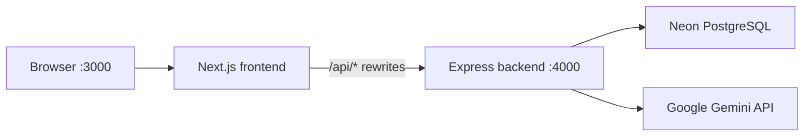

# Harbourside Veterinary Clinic - Pet Record Management System

A full-stack veterinary clinic management system with AI Chatbot integration (**PawBot**) for **Harbourside Veterinary Clinic**. Staff manage pets, appointments, care histories, laboratory tests, inventory, transactions, and multi-channel communications; pet owners use a self-service portal to manage their pets, request appointments, inspect payment statements, and track vaccinations.

All dates, timestamps, log entries, reminders, and printable reports use **Philippine Time (Asia/Manila, UTC+8)**.

---

## Table of Contents

- [Features](#features)
- [Architecture](#architecture)
- [Tech Stack](#tech-stack)
- [Prerequisites](#prerequisites)
- [Project Structure](#project-structure)
- [Getting Started](#getting-started)
- [Environment Variables](#environment-variables)
- [Accounts & Authentication](#accounts--authentication)
- [API Overview](#api-overview)
- [PawBot (AI Chatbot)](#pawbot-ai-chatbot)
- [Key Workflows](#key-workflows)
- [Scripts Reference](#scripts-reference)
- [Deployment Notes](#deployment-notes)
- [Troubleshooting](#troubleshooting)

---

## Features

### Admin & Staff Portal (`/admin`)

| Module | Description |
|--------|-------------|
| **Dashboard** | Operational summary cards (registered pets, owners, staff, today's appointments, pending requests, inventory alerts, health status breakdown) and real-time activity stream |
| **Manage Pets** | Medical profile tracking, pet code (`PET-100234`), age, weight, microchip #, blood type, allergies, conditions, and health status (`Healthy`, `Under Treatment`, `Recovered`, `Deceased`) |
| **Manage Owners** | Owner directory (`OWN-100234`), contact info, emergency contacts, account status (`Active`/`Inactive`), walk-in flag (`is_walk_in`), and multi-tab owner profile modal |
| **Schedule** | Interactive Daily/Weekly/Monthly calendar booking, approving, rescheduling, completing, or cancelling appointments. Supports scheduled & walk-in clients |
| **Care History** | Centralized medical visit logs (Check-ups, Vaccinations, Treatments, Dewormings) linked to pet profiles and inventory auto-deduction |
| **Inventory** | Stock management for Medicines, Vaccines, Dewormers, and Medical Supplies with stock-in/out transactions, low-stock warnings, and expiration tracking |
| **Lab & Transactions** | Clinic billing records (`TXN-100234`), Cash/GCash payment methods, payment status (`Pending`/`Paid`), one-click payment confirmation, printable receipts, and Laboratory test records (`LAB-100234`) |
| **Communications** | Multi-channel messaging hub (`In-App`, `Email`, `SMS`, multi-channel delivery), message templates, 24h appointment reminders, vaccination/deworming reminders, and top header notification bell integration |
| **Reports** | Navigation center with 8 specialized historical reports (Appointments, Care History, Pets, Owners, Inventory, Transactions, Communications, Staff Activity), Recharts analytics, search, date range filters, CSV export, and official print layout |
| **PawBot** | AI chat assistant integrated into the bottom-right of the portal |

### Pet Owner Portal (`/user`)

| Module | Description |
|--------|-------------|
| **Dashboard** | Summary of registered pets, upcoming appointments, vaccination due dates, and care reminders |
| **My Pets** | Pet medical records, care history timeline, and vaccination details |
| **Appointments** | Self-service appointment requests, rescheduling, and cancellation |
| **Care History** | Complete medical record history for owned pets |
| **Vaccinations** | Track vaccination schedules and upcoming due dates |
| **Transactions** | Read-only payment transaction statement view (`/user/transactions`) and receipt printing |
| **Messages** | Message history log (`/user/messages`) of received clinic emails, SMS notifications, and in-app alerts |
| **PawBot** | AI chat assistant for appointment guidance, vaccine reminders, and pet care advice |

---

## Architecture

The app is split into a **Next.js frontend** (UI) and an **Express backend** (API, auth, business logic, PostgreSQL database). The frontend proxies API calls to the backend via Next.js rewrites (`/api/*`).


```mermaid
flowchart LR
  Browser["Browser :3000"]
  Next["Next.js frontend"]
  Express["Express backend :4000"]
  Neon["Neon PostgreSQL"]
  Gemini["Google Gemini API"]

  Browser --> Next
  Next -->|"/api/* rewrites"| Express
  Express --> Neon
  Express --> Gemini
```

| Layer | Port (dev) | Responsibility |
|-------|------------|----------------|
| Frontend | `3000` | UI views, components, client-side data fetching |
| Backend | `4000` | REST API, JWT session cookies, file uploads, automated completion hooks, AI chat |
| Database | — | Serverless PostgreSQL database (Neon) |

---

## Tech Stack

### Frontend (`frontend/`)

- **Next.js 15** (App Router)
- **React 18** + **TypeScript**
- **Tailwind CSS** + **shadcn/ui** (Radix primitives)
- **TanStack Query** for server state management
- **Recharts** for analytics and reports
- **Lucide** icons

### Backend (`backend/`)

- **Node.js** + **Express 4**
- **TypeScript** (compiled with `tsc`, dev with `tsx watch`)
- **Neon serverless driver** (`@neondatabase/serverless`) for PostgreSQL raw SQL
- **Prisma** for schema definition
- **jose** for JWT session tokens
- **bcryptjs** for password hashing
- **multer** for image uploads
- **Nodemailer** for email delivery simulation
- **Google Gemini** for PawBot AI assistant

---

## Prerequisites

- **Node.js** 20+ (22 recommended)
- **npm** 9+
- A **Neon** PostgreSQL database ([free tier](https://neon.tech))
- (Optional) **Google Cloud** project for OAuth and/or Gemini API key

---

## Project Structure

```
HARBOURSIDE/
├── package.json              # Root workspace scripts
├── README.md
├── frontend/
│   ├── src/
│   │   ├── app/              # Next.js App Router pages (/admin, /user)
│   │   ├── components/       # UI components, UserSidebar, AdminSidebar, NotificationBell
│   │   ├── hooks/            # useAuth, useOwnerData, useRows
│   │   ├── lib/              # datetime (Asia/Manila), notifications, API client
│   │   └── views/            # Page-level view components (ManagePets, ManageOwners, LabTransactions, Reports, Messaging)
│   ├── next.config.ts        # Proxies /api/* → backend
│   └── .env.example
└── backend/
    ├── src/
    │   ├── index.ts          # Express entry point
    │   ├── routes/           # auth, data, chat, upload, appointments
    │   ├── services/         # Business logic (data, auth, chat, google, automatic completion hooks)
    │   ├── middleware/       # requireAuth
    │   └── lib/              # db pool, datetime helpers
    ├── db/schema.sql         # PostgreSQL schema & trigger functions
    ├── scripts/
    │   ├── create-admin.mjs
    │   └── run-schema.mjs
    └── .env.example
```

---

## Getting Started

### 1. Clone and Install

```powershell
cd C:\HARBOURSIDE
npm install
npm run install:all
```

`install:all` installs dependencies in both `backend/` and `frontend/`.

### 2. Configure Environment Variables

Copy environment files and set credentials:

```powershell
copy backend\.env.example backend\.env
copy frontend\.env.example frontend\.env
```

### 3. Initialize Database Schema

```powershell
cd backend
npm run db:push
cd ..
```

`db:push` executes `backend/db/schema.sql` (creates tables, columns, indexes, triggers, and seed records).

### 4. Create Initial Admin Account

```powershell
npm run create-admin -- admin@clinic.com "Dr. Admin" "your-secure-password"
```

Sign in at [http://localhost:3000/login](http://localhost:3000/login).

### 5. Start Development Servers

From the root directory:

```powershell
npm run dev
```

- **Backend** → [http://localhost:4000](http://localhost:4000)
- **Frontend** → [http://localhost:3000](http://localhost:3000)

Verify backend health:

```powershell
curl http://localhost:4000/health
```

---

## Key Workflows

### 1. Walk-in Patient Workflow
1. Staff opens `/admin/owners` → Click **Register Walk-in Owner** (`is_walk_in = true`).
2. Staff opens `/admin/pets` → Register Pet linked to the Walk-in Owner.
3. Staff opens `/admin/schedule` → Create **Walk-in Appointment**.
4. Upon changing appointment status to **Completed**:
   - Backend automatically creates a linked **Care History** record.
   - Automatically deducts corresponding items from **Inventory**.
   - Automatically generates a pending **Clinic Transaction** (`TXN-XXXXXX`) in `lab_transactions`.

### 2. Multi-Channel Communications & Reminders
- Dispatches messages via **In-App Notification**, **Email**, or **SMS**.
- Pre-configured templates: `Appointment Approved`, `Appointment Reminder`, `Vaccination Reminder`, `Deworming Reminder`, `General Announcement`, and `Custom Message`.
- Every message automatically updates the recipient's top header `<NotificationBell />`.

### 3. Reports & Historical Analytics
- **8 Specialized Reports:** Appointments, Care History, Pets, Owners, Inventory, Transactions, Communications, Staff Activity.
- **Recharts Analytics:** Visual trend breakdowns for statuses, care types, species, revenues, and channels.
- **Export & Official Print:** Export CSV files and print official clinic reports with logo, date (Asia/Manila), filter details, and data tables.

---

## License

Private project - Harbourside Veterinary Clinic.
